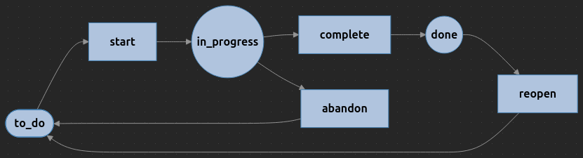
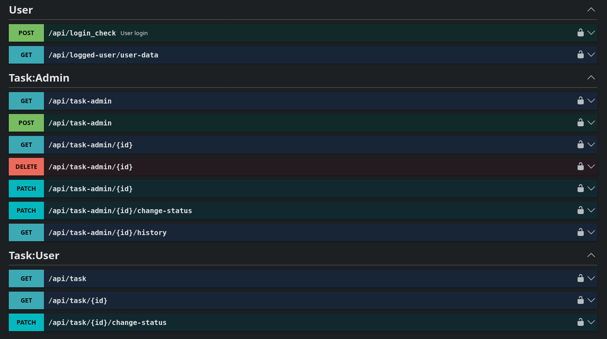

# Task Manager

This project is a sample **Task Manager** application where users can create tasks, assign them, and track their 
status throughout the workflow.

The application includes a **custom mechanism for storing the history of changes within entities**, allowing full 
traceability of modifications.

It is built using **Symfony 7.4** and **PHP 8.5**, following **clean code principles** and leveraging 
**design patterns**, **architectural patterns**, and a **layered architecture**. The system also 
an **Event-Driven Development** approach to improve decoupling and scalability.

The application exposes a **REST API**, making it suitable for integration with external services or frontend applications.

## Basic commands

Import sample users from JSONPlaceholder:

    bin/console app:user:import-from-json-placeholder

Configure password for a user:

    bin/console app:user:configure-password shanna@melissa.tv User12345678

```
Usage:
  app:user:configure-password <email> <password>

Arguments:
  email                 User Email
  password              User Password
```

Configure roles for a user:

    bin/console app:user:configure-roles sincere@april.biz ROLE_ADMIN

```
Usage:
  app:user:configure-roles <email> [<roles>...]

Arguments:
  email                 User Email
  roles                 User Roles Array
```

## Task Status Workflow

Task statuses are managed using the **Symfony Workflow** component, which enables the definition and control of the
task lifecycle through a configurable state machine. It allows the application to clearly define available 
states (such as created, in progress, completed, etc.) and the valid transitions between them.



The workflow configuration can be found in:

* [workflow.yaml](src/Infrastructure/config/workflow.yaml)

Definition of statuses and transitions:

* [TaskStatus.php](src/Domain/Task/TaskStatus.php)
* [TaskStatusTransition.php](src/Domain/Task/TaskStatusTransition.php)

## Entity History

A universal solution for storing the change history of any entity has been implemented. 
The implementation can be found in the [Core/Doctrine/History](src/Core/Doctrine/History) directory.

In the [services.yaml](config/services.yaml) file, you can configure the list of supported entities and add data normalizers:

```yaml
App\Core\Doctrine\History\HistoryEntityMap:
    arguments:
        -
            App\Domain\Task\Entity\Task: App\Domain\Task\Entity\TaskHistory

App\Core\Doctrine\History\HistoryNormalizerComposite:
    calls:
        -   method: add
            arguments: ['@App\Core\Doctrine\History\Normalizer\NullNormalizer']
        -   method: add
            arguments: ['@App\Core\Doctrine\History\Normalizer\ScalarNormalizer']
        -   method: add
            arguments: ['@App\Core\Doctrine\History\Normalizer\DateTimeNormalizer']
        -   method: add
            arguments: ['@App\Core\Doctrine\History\Normalizer\EnumNormalizer']
        -   method: add
            arguments: ['@App\Core\Doctrine\History\Normalizer\ObjectNormalizer']

```

You can create your own strategies for persisting changes in the database using the [PersistStrategy](src/Core/Doctrine/History/PersistStrategy.php) interface.
However, a more useful approach is the ability to react to changes using a [HistoryObserver](src/Core/Doctrine/History/HistoryObserver.php). 
An example of this usage can be found in the [TaskStatusObserver](src/Application/Task/Interaction/History/TaskStatusObserver.php) class.

## Task Event Logger

A simple event logger for tasks has also been implemented. An example of its usage can be found in the subscriber for the `TaskCreatedEvent` domain event.

* [LogSubscriber](src/Application/Task/Interaction/Event/TaskCreatedEvent/LogSubscriber.php)

## Endpoints



## Copyrights

Copyright © Rafał Mikołajun 2026.
